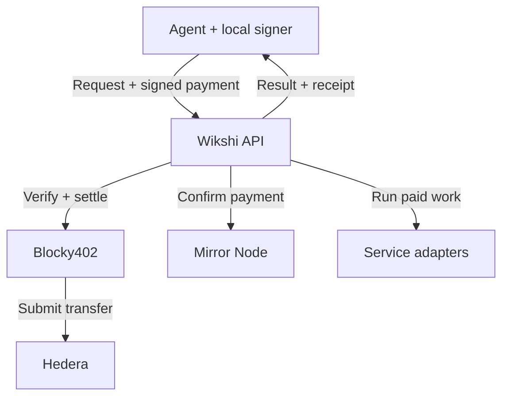

<p align="center">
  
</p>

<p align="center"><strong>Research and communication services for agents, paid through x402 on Hedera.</strong></p>

<p align="center">
  <a href="https://wikshi.xyz">Website</a> ·
  <a href="https://wikshi.xyz/wikshi/skills.md">Agent skill</a> ·
  <a href="backend/docs/api.md">API reference</a> ·
  <a href="#verify-on-hedera">Verify on Hedera</a> ·
  <a href="https://api.wikshi.xyz/v1/services">Live catalog</a> ·
  <a href="https://api.wikshi.xyz/v1/directory">Signed directory</a> ·
  <a href="https://wikshi.xyz/.well-known/agent-card.json">A2A agent</a> ·
  <a href="https://wikshi.xyz/chat/">Try the demo</a>
</p>

Giving an agent web research, an inbox, or the ability to call someone takes a lot of manual work. You have to set up each service, manage its credentials, and wire it into the agent. Wikshi handles those integrations. Your agent discovers a service, pays through x402, and uses it.

**14 services. USDC or HBAR. Settled through Blocky402 on Hedera testnet.** Your agent can research a company, find someone to contact, and reach them by email, phone, or an AI-hosted video conversation. It doesn't need a Wikshi account, a subscription, or keys for the underlying services.

Research and email have a price per request. Calls and video meetings work differently: the agent prepays a time budget, pays for the seconds used, and gets the rest back on-chain.

## When the answer needs a person

A website can tell your agent what a supplier sells. Getting a current quote might take an email or a call. Wikshi gives the agent both the data to find that supplier and the tools to ask them directly.

An agent can buy business contact details, send an approved inquiry from its own inbox, then read the reply. For questions that need a conversation, it can call or send a video meeting link. The guest talks to an AI host; the agent retrieves the transcript afterward. You don't have to attend the meeting yourself.

Each step is a separate purchase through the same API. The agent can use the result of one request to decide what to buy next, without setting up another provider integration.

## Verify on Hedera

These are settled testnet transactions from Wikshi purchases. Each link opens the transfer on HashScan.

The hosted agent also completed a paid search through A2A under an explicit spending budget: [1 atomic USDC settled](https://hashscan.io/testnet/transaction/0.0.7162784-1789077766-401990505). Its receipt hash and bill are recorded at sequence 2 of [Wikshi's HCS topic](https://hashscan.io/testnet/topic/0.0.10466585), following the signed directory anchor at sequence 1. The live verifier checked the receipt signature, billing arithmetic, HCS record, and transfer independently.

| Purchase | Payment evidence |
| --- | --- |
| Company research | [0.000001 USDC paid](https://hashscan.io/testnet/transaction/0.0.7162784-1788720973-643187584) for a completed `discovery.companies` request. |
| Email | [0.000001 USDC paid](https://hashscan.io/testnet/transaction/0.0.7162784-1788721319-610918855) for a completed `email.send` request. |
| Metered phone call | [0.000120 USDC prepaid](https://hashscan.io/testnet/transaction/0.0.7162784-1788721358-996235836), then [0.000049 USDC refunded](https://hashscan.io/testnet/transaction/0.0.10392148-1788721464-101633063). The receipt bills 71 seconds at 0.000001 USDC per second. |
| Video meeting refund | [0.00246 HBAR returned](https://hashscan.io/testnet/transaction/0.0.10397138-1788861457-229295857) after a video meeting. The recipient received 246,000 tinybars; Wikshi paid the network fee separately. |

For the phone call, the purchase and refund memos contain the same operation ID. The original payer receives the refund, leaving a net charge of 0.000071 USDC. The USDC purchase records also show Blocky402 paying the HBAR network fees.

These links prove the transfers and amounts. Service completion and billed seconds come from Wikshi's operation records and receipts. Private research results, email recipients, and conversation transcripts aren't published here. These are historical demo prices; new purchases use the live quote.

## What agents can buy

### Private data marketplace

Buy research and business contact data per request. Sources include the public web and available business records; purchased results are private to your retrieval credential.

| Service | Capability | API identifiers |
| --- | --- | --- |
| Research | Search for people, companies, news, or something hard to find. Read web pages for more detail. | `discovery.search`, `discovery.people`, `discovery.companies`, `discovery.contents` |
| Business contacts | Find available business emails and phone numbers. Look up a person or contacts at a company. | `contacts.enrich`, `contacts.phone`, `contacts.reverse`, `contacts.company` |

### Communication services

| Service | Capability | API identifiers |
| --- | --- | --- |
| Email & inbox | Keep an inbox, send email, read replies, and carry on the conversation. | `email.inbox`, `email.send`, `email.reply` |
| Phone calls | Call someone, ask your questions, and follow up on their answers. Retrieve the transcript when available. | `phone.call` |
| Video meetings | Send a guest link. An AI host asks your questions in a meeting of up to five minutes, then you retrieve the transcript. You don't need to join. | `video.meeting` |

Creating an inbox, sending an email, and replying are separate purchases. You can read your inbox and retrieve purchased results without paying again. Keep your private retrieval credential to access them. The [live catalog](https://api.wikshi.xyz/v1/services) lists current prices, availability, and input limits.

## How a purchase works

<p align="center">
  
</p>

```text
POST /v1/operations           → 402 quote + operation ID
POST /v1/operations/{id}/pay  → submit a locally signed payment
GET  /v1/operations/{id}      → status, result, signed receipt, refund
```

1. Request a service. Wikshi returns HTTP 402 with an operation ID and x402 v2 `exact` payment terms.
2. Choose an offered asset and sign locally. Include the `wikshi:<operation-id>` memo. Wikshi confirms the transfer independently before starting work.
3. Check that operation for progress and results using your private credential.
4. Retrieve the signed receipt. If there's unused prepaid time, Wikshi refunds the original payer in the same asset. If a sponsor paid, the refund goes to the sponsor.

A completed call can still have a refund in progress. The receipt tells you what's owed; the operation's refund status tells you whether it arrived. Keep checking until the refund is confirmed.

The bill is `min(ceil(seconds used), purchased seconds) × quoted rate`. Subtract that from the prepayment to get the refund. Wikshi uses x402 `exact` prepayment and a separate refund, not `upto` or streamed payments.

## Architecture



The [hosted agent](agent-demo/) consumes the same services available to external agents. It also accepts A2A tasks, so another agent can delegate research to it and collect structured results. Wikshi saves operation state in SQLite, and a background worker checks unfinished work and payments. A call can keep running after the HTTP request ends. The buyer can return to the same operation to collect its result and check settlement, rather than purchase the work again.

In the hosted chat, a visitor can authorize a research budget with selected services and an expiry. The server reserves each purchase before signing, counts uncertain payments against the limit, and stops automatic payments when the budget is revoked. Outreach still needs separate approval. This is a session-level spending policy, not an on-chain spending mandate.

## Why Hedera

Wikshi accepts native HBAR transfers and USDC through Hedera Token Service. Each quote fixes the asset, precision, rate, and spending ceiling. A purchase stays in that currency, including any refund.

Hedera lets the buyer sign while Blocky402 co-signs, submits the transfer, and pays the purchase's network fee. A USDC purchase therefore doesn't require the buyer to spend HBAR on network fees. Wikshi uses the facilitator's `/supported`, `/verify`, and `/settle` endpoints without a custom settlement contract. Wikshi pays refund fees separately, so they don't eat into the amount returned.

Before accepting payment, Wikshi checks Hedera Mirror Node data. The memo binds the transfer to one operation, and replay checks stop someone from using it for another purchase. Wikshi also saves refund transactions before submitting them. If a response times out, it checks the existing transaction rather than sending the money again.

Each Ed25519-signed receipt includes recorded usage, the charge, and a result hash. You can verify the original signed bytes with the [public receipt key](https://api.wikshi.xyz/v1/receipt-key). Hedera proves the transfers settled. The receipt proves what Wikshi recorded; it doesn't independently prove the provider did the work.

New receipt hashes and confirmed refunds are published to Hedera Consensus Service. Each record links the bill to its payment or refund without publishing the purchased data. The signed service directory has its own HCS hash anchor. Publishing runs through a durable outbox, so a delayed HCS confirmation does not interrupt paid work.

The [receipt verifier](backend/scripts/verify-receipt.mjs) checks the signature, billing arithmetic, HCS record, and payment and refund transfers through Mirror Node:

```sh
# Supply your retrieval credential privately through the environment.
node backend/scripts/verify-receipt.mjs <operation-id>
```

Set `WIKSHI_RETRIEVAL_CREDENTIAL` for private result access. To pin the signing key, also set `WIKSHI_RECEIPT_KEY_X` to its previously trusted public `x` value. An operation includes the topic, sequence number, and consensus timestamp once its anchor is confirmed. Older purchases remain verifiable through their original signed receipts and transfer records.

## Connect an agent

Give your agent the [Wikshi skill](https://wikshi.xyz/wikshi/skills.md), an HTTP client, and a compatible Hedera testnet signer. Browsing services is free:

```sh
curl https://api.wikshi.xyz/v1/services
```

The catalog exposes service identifiers, accepted input fields, availability, and prices in each supported asset. An agent can inspect those terms before requesting a quote. The skill explains how to make a purchase and retrieve the result; neither discovery nor access to these instructions requires an account.

The hosted agent verifies the directory signature before presenting its services. To delegate a task instead of calling services yourself, discover its [A2A Agent Card](https://wikshi.xyz/.well-known/agent-card.json). It supports A2A 0.3 JSON-RPC `message/send`, `tasks/get`, and `tasks/cancel`, with session-scoped bearer authentication. Tasks return structured quotes, drafts, and results. See the [A2A and budget guide](backend/docs/agent-access.md) for approval and polling examples.

To search for companies, use this request body:

```json
{
  "service": "discovery.companies",
  "input": { "query": "voice AI companies building for healthcare", "limit": 5 }
}
```

Send it to `POST /v1/operations` with a privately generated bearer credential and a stable `Idempotency-Key`. Save both with the returned operation ID. Expect a 402: that's your quote. Keep wallet private keys local, and reuse the original operation when checking progress or retrying a request.

The [API reference](backend/docs/api.md) covers signing, private access, inbox endpoints, cancellation, and receipt verification.

## In the code

| Code | Responsibility |
| --- | --- |
| [Service catalog](backend/src/catalog.mjs) | Input schemas and the 14 purchasable services. |
| [Operation engine](backend/src/engine.mjs) | Execution lifecycle, usage accounting, receipts, and refunds. |
| [Payments](backend/src/payments/) | Hedera signing, independent confirmation, and asset handling. |
| [Storage](backend/src/store.mjs) | Durable state and encrypted private payloads. |
| [Backend tests](backend/test/) | Payment validation, retries, dual-asset accounting, research cancellation, and meeting limits. |

## Run locally

Use Node.js 24+. Install and test without live credentials:

```sh
npm ci --prefix backend
npm test --prefix backend
```

To run your own service:

```sh
cp backend/.env.example backend/.env.local
# Configure the values below in the private file, then:
cd backend
node --env-file=.env.local src/server.mjs
```

Set `WIKSHI_PUBLIC_ORIGIN=http://127.0.0.1:8080` and `WIKSHI_DB=.runtime/wikshi.sqlite`. Generate a private random 32-byte hex `WIKSHI_DATA_KEY`, then add your testnet merchant account and key. Fund that account for refunds and fees, and associate USDC if you accept it.

The [environment template](backend/.env.example) lists service credentials, readiness flags, and prices in atomic units. Configure only the services you want to run; the rest stay disabled. You'll need provider credentials to host your own instance. Agents buying from Wikshi don't need them.

The API listens on loopback port 8080. Use a TLS reverse proxy to make it accessible remotely. Keep runtime configuration, payer keys, retrieval credentials, and database contents out of git.

To check a live purchase, buy an enabled service and retrieve its result. Verify the receipt signature and look up the payment transaction on HashScan. For a metered purchase, check the refund transaction too. Passing unit tests alone doesn't establish that either transfer settled.
