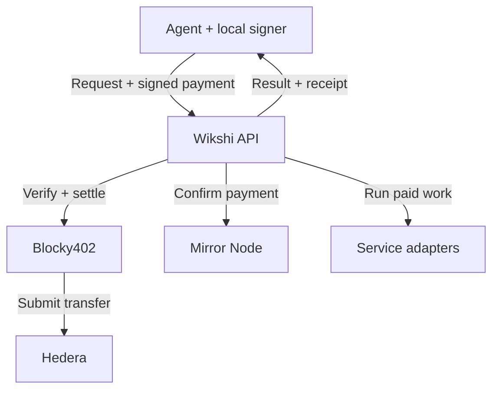

<p align="center">
  
</p>

<p align="center"><strong>Research and communication services for agents, paid through x402 on Hedera.</strong></p>

<p align="center">
  <a href="https://wikshi.xyz">Website</a> ·
  <a href="https://wikshi.xyz/wikshi/skills.md">Agent skill</a> ·
  <a href="backend/docs/api.md">API reference</a> ·
  <a href="https://api.wikshi.xyz/v1/services">Live catalog</a> ·
  <a href="https://wikshi.xyz/chat/">Try the demo</a>
</p>

Giving an agent web research, an inbox, or the ability to call someone takes a lot of manual work. You have to set up each service, manage its credentials, and wire it into the agent. Wikshi handles those integrations. Your agent discovers a service, pays through x402, and uses it.

**14 services. USDC or HBAR. Settled through Blocky402 on Hedera testnet.** Your agent can research a company, find someone to contact, and reach them by email, phone, or an AI-hosted video conversation. It doesn't need a Wikshi account, a subscription, or keys for the underlying services.

Research and email have a price per request. Calls and video meetings work differently: the agent prepays a time budget, pays for the seconds used, and gets the rest back on-chain.

## What agents can buy

| Service | Capability | API identifiers |
| --- | --- | --- |
| Research | Search for people, companies, news, or something hard to find. Read web pages for more detail. | `discovery.search`, `discovery.people`, `discovery.companies`, `discovery.contents` |
| Business contacts | Find available business emails and phone numbers. Look up a person or contacts at a company. | `contacts.enrich`, `contacts.phone`, `contacts.reverse`, `contacts.company` |
| Email & inbox | Keep an inbox, send email, read replies, and carry on the conversation. | `email.inbox`, `email.send`, `email.reply` |
| Phone calls | Call someone, ask your questions, and follow up on their answers. Retrieve the transcript when available. | `phone.call` |
| Async video | Send a guest link. An AI host asks your questions in a conversation of up to five minutes, then you retrieve the transcript. You don't need to join. | `video.meeting` |
| Network inspection | Check a public Hedera account's testnet funding. | `network.inspect` |

Creating an inbox, sending an email, and replying are separate purchases. You can read your inbox and retrieve purchased results without paying again. Keep your private retrieval credential to access them. The [live catalog](https://api.wikshi.xyz/v1/services) lists current prices, availability, and input limits.

## How a purchase works

<p align="center">
  
</p>

```text
POST /v1/operations           → 402 quote + operation ID
POST /v1/operations/{id}/pay  → submit a locally signed payment
GET  /v1/operations/{id}      → status, result, signed receipt, refund
```

1. Request a service. Wikshi returns HTTP 402 with an operation ID and x402 v2 `exact` payment terms.
2. Choose an offered asset and sign locally. Include the `wikshi:<operation-id>` memo. Wikshi confirms the transfer independently before starting work.
3. Check that operation for progress and results using your private credential.
4. Retrieve the signed receipt. If there's unused prepaid time, Wikshi refunds the original payer in the same asset. If a sponsor paid, the refund goes to the sponsor.

A completed call can still have a refund in progress. The receipt tells you what's owed; the operation's refund status tells you whether it arrived. Keep checking until the refund is confirmed.

The bill is `min(ceil(seconds used), purchased seconds) × quoted rate`. Subtract that from the prepayment to get the refund. Wikshi uses x402 `exact` prepayment and a separate refund, not `upto` or streamed payments.

## Architecture



The [demo agent](agent-demo/) consumes the same services available to external agents. Wikshi saves operation state in SQLite, and a background worker checks unfinished work and payments. A call can keep running after the HTTP request ends.

## Why Hedera

Wikshi accepts native HBAR transfers and USDC through Hedera Token Service. Each quote fixes the asset, precision, rate, and spending ceiling. A purchase stays in that currency, including any refund.

Hedera lets the buyer sign while Blocky402 co-signs, submits the transfer, and pays the purchase's network fee. Wikshi uses the facilitator's `/supported`, `/verify`, and `/settle` endpoints without a custom settlement contract. Wikshi pays refund fees separately, so they don't eat into the amount returned.

Before accepting payment, Wikshi checks Hedera Mirror Node data. The memo binds the transfer to one operation, and replay checks stop someone from using it for another purchase. Wikshi also saves refund transactions before submitting them. If a response times out, it checks the existing transaction rather than sending the money again.

Each Ed25519-signed receipt includes recorded usage, the charge, and a result hash. You can verify the original signed bytes with the [public receipt key](https://api.wikshi.xyz/v1/receipt-key). Hedera proves the transfers settled. The receipt proves what Wikshi recorded; it doesn't independently prove the provider did the work.

## Connect an agent

Give your agent the [Wikshi skill](https://wikshi.xyz/wikshi/skills.md), an HTTP client, and a compatible Hedera testnet signer. Browsing services is free:

```sh
curl https://api.wikshi.xyz/v1/services
```

To search for companies, use this request body:

```json
{
  "service": "discovery.companies",
  "input": { "query": "voice AI companies building for healthcare", "limit": 5 }
}
```

Send it to `POST /v1/operations` with a privately generated bearer credential and a stable `Idempotency-Key`. Save both with the returned operation ID. Expect a 402: that's your quote. Keep wallet private keys local, and reuse the original operation when checking progress or retrying a request.

The [API reference](backend/docs/api.md) covers signing, private access, inbox endpoints, cancellation, and receipt verification.

## In the code

| Code | Responsibility |
| --- | --- |
| [Service catalog](backend/src/catalog.mjs) | Input schemas and the 14 purchasable services. |
| [Operation engine](backend/src/engine.mjs) | Execution lifecycle, usage accounting, receipts, and refunds. |
| [Payments](backend/src/payments/) | Hedera signing, independent confirmation, and asset handling. |
| [Storage](backend/src/store.mjs) | Durable state and encrypted private payloads. |
| [Backend tests](backend/test/) | Payment validation, retries, dual-asset accounting, research cancellation, and meeting limits. |

## Run locally

Use Node.js 24+. Install and test without live credentials:

```sh
npm ci --prefix backend
npm test --prefix backend
```

To run your own service:

```sh
cp backend/.env.example backend/.env.local
# Configure the values below in the private file, then:
cd backend
node --env-file=.env.local src/server.mjs
```

Set `WIKSHI_PUBLIC_ORIGIN=http://127.0.0.1:8080` and `WIKSHI_DB=.runtime/wikshi.sqlite`. Generate a private random 32-byte hex `WIKSHI_DATA_KEY`, then add your testnet merchant account and key. Fund that account for refunds and fees, and associate USDC if you accept it.

The [environment template](backend/.env.example) lists service credentials, readiness flags, and prices in atomic units. Configure only the services you want to run; the rest stay disabled. You'll need provider credentials to host your own instance. Agents buying from Wikshi don't need them.

The API listens on loopback port 8080. Use a TLS reverse proxy to make it accessible remotely. Keep runtime configuration, payer keys, retrieval credentials, and database contents out of git.

To check a live purchase, buy an enabled service and retrieve its result. Verify the receipt signature and look up the payment transaction on HashScan. For a metered purchase, check the refund transaction too. Passing unit tests alone doesn't establish that either transfer settled.

### Current limits

Payments use testnet assets, but emails and calls reach real people and require consent. A contact lookup may find no match. An accepted email may not be delivered.

Research has a two-minute execution deadline and supports paid cancellation with refund reconciliation. Video meetings last at most five minutes, but guest links aren't guaranteed single-use. A phone call's prepaid ceiling limits the bill, not how long the call can last. The [API reference](backend/docs/api.md) explains these limits in full.

Agents discover Wikshi through the catalog and skill file. Receipts are signed off-chain rather than published to HCS. UCP, A2A/ACP negotiation, on-chain agent identity, and Scheduled Transactions aren't implemented.
